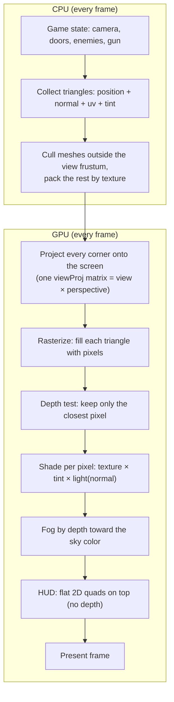

# How rendering works

One sentence: **a classic polygon pipeline.** The CPU builds a list of
triangles, the GPU projects them onto the screen, fills them in pixel by
pixel, and keeps only the closest pixel at every spot. No raycasting, no ray
tracing.

## The frame, step by step

1. **Collect triangles (CPU).** The game state (maze, doors, enemies, gun,
   camera) becomes a list of triangles. Each triangle corner (vertex) carries
   a 3D position, a surface normal, a texture coordinate (`uv`), and a tint
   color. Normals are derived from the triangle winding, so every face knows
   which way it points.
2. **Cull and pack (CPU).** Meshes whose bounding box lies fully outside the
   camera's view frustum are skipped (frustum culling — nothing outside the
   frame is drawn). The rest are packed into vertex buffers, grouped by
   texture, so each group can be drawn in one GPU draw call. This happens
   *every frame* so doors can slide and enemies can move; the textures
   themselves are uploaded once at startup.
3. **Camera and light math (CPU).** The game builds one 4×4 matrix — "look at
   the scene from the camera" (view) combined with "pinhole lens"
   (perspective projection) — plus a fixed light direction and fog
   near/far distances. These are the only rendering inputs the shaders
   receive.
4. **Project (GPU, vertex shader).** Every triangle corner is multiplied by
   that matrix and lands at a 2D screen position, carrying a depth value and
   its normal.
5. **Rasterize (GPU).** For each triangle, the GPU finds which screen pixels
   it covers and smoothly spreads (`interpolates`) the `uv`, tint, normal,
   and depth across them.
6. **Depth test (GPU).** Each pixel remembers how far away the last triangle
   drawn there was (a z-buffer, cleared every frame). A new pixel wins only
   if it is closer. This is what lets a wall hide what is behind it.
7. **Shade (GPU, fragment shader).** Final pixel color = texture color at
   the `uv` spot × the tint × a simple per-pixel light: `ambient 0.45 +
   0.55 × max(normal · light, 0)`, clamped to 0.35..1. Flat-colored faces
   use a 1×1 white texture, so a single pipeline handles textured and flat
   triangles alike.
8. **Fog (GPU).** Distant pixels are blended toward the dark sky color by
   depth (`smoothstep(fog near, fog far)`), which hides the edge of the
   maze and gives a sense of scale.
9. **HUD (GPU).** A second, simpler pass draws flat 2D colored rectangles on
   top — crosshair, health/ammo bars. No depth, no texture; positions are
   given directly in screen coordinates.
10. **Present.** The finished image is shown; the next frame starts over.

## What it is not

- **Not raycasting** (how the original 1993 Doom rendered: one ray per screen
  column). Here full 3D triangles go through the pipeline.
- **Not ray tracing** (one ray per pixel, bouncing off surfaces). There are
  no rays at all; the GPU hardware-triangle pipeline plus the z-buffer
  decides what is visible.

## Where in the code

| Path | Part it plays |
|---|---|
| `src/world.rs`, `src/obj.rs` | Turn the game into triangles (build geometry, load OBJ/MTL + textures) |
| `src/math.rs` | The view + perspective matrices (steps 3–4) |
| `src/renderer.rs` | The wgpu pipelines, per-frame packing, depth buffer, HUD draw, present (steps 2, 5–9) |